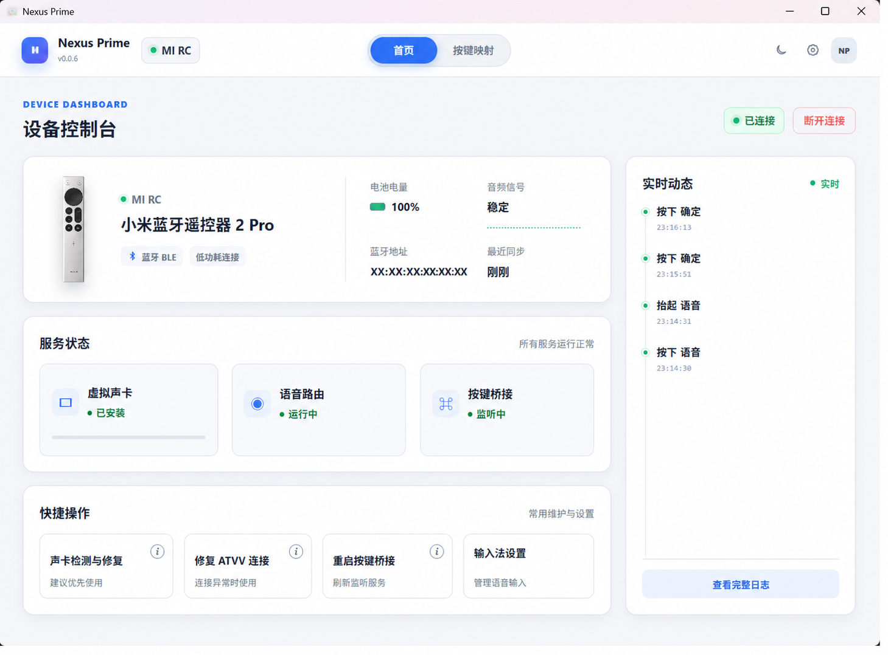
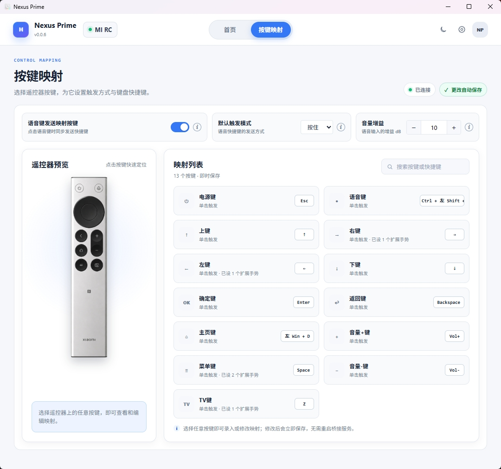
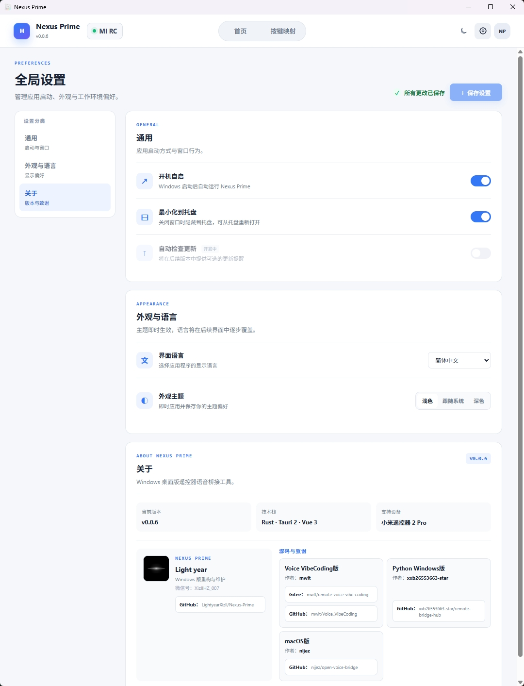

# Nexus Prime

Nexus Prime 是一款面向 Windows 的小米遥控器 2 Pro 桌面桥接工具。它通过蓝牙读取遥控器按键与 ATVV 语音数据，把按键转换为可自定义的键盘快捷键，并将语音路由到虚拟声卡，供输入法或其他语音软件使用。

当前版本：**v0.3.1**

技术栈：**Rust · Tauri 2 · Vue 3 · TypeScript**

> 本项目不需要 API Key、账号密码或远程业务服务器。音频和 HID 桥接均绑定本机回环地址。

## 功能特点

- 连接小米遥控器 2 Pro，显示连接、电量、音频和服务状态；
- 为电源、方向、确认、返回、主页、菜单、音量、TV 和语音键配置快捷键；
- 支持单击、长按等触发方式及多键组合；
- 订阅 ATVV 语音通道，解码并路由音频到 VB-CABLE；
- 提供实时音频状态、连接日志和故障提示；
- 检测并修复 VB-CABLE 虚拟声卡环境；
- 内嵌 WinUHid 虚拟键盘：让豆包、微信等会过滤普通模拟按键的输入法，也能收到语音快捷键；
- 首页提供声卡、虚拟键盘、ATVV 与按键桥接的一键修复，修复过程互斥并显示结果；
- 检测端口或进程冲突，并提供 ATVV 修复与按键桥接重启；
- 通过 HID Tap 处理返回键、音量键等系统 HID 报告；
- 支持托盘运行、可选开机自启与登录时最小化、深浅主题和单实例启动。

## 软件截图

### 首页

首页截图中的真实蓝牙地址已替换为占位符。



### 按键映射



### 全局设置



截图文件统一存放在 [`image/`](./image/)。

## 系统要求

### 运行软件

| 项目 | 要求 |
| --- | --- |
| 操作系统 | Windows 10 / 11，64 位 |
| 蓝牙 | 支持 BLE，且遥控器已在 Windows 中完成配对 |
| WebView | Microsoft Edge WebView2 Runtime |
| 语音路由 | VB-Audio VB-CABLE |

### 从源码开发

| 工具 | 要求 |
| --- | --- |
| Node.js | 18.x 或 20+，建议使用当前 LTS |
| npm | 随 Node.js 安装 |
| Rust | `rustup` 安装的 stable MSVC 工具链 |
| C++ 工具链 | Visual Studio Build Tools，勾选“使用 C++ 的桌面开发” |
| WebView2 | Windows 10/11 通常已安装 |

Windows 依赖可参考 [Tauri 2 官方准备工作](https://v2.tauri.app/start/prerequisites/)。

## 安装方法

### 使用发布版

项目发布后，可从 GitHub Releases 下载 NSIS 安装包：

- NSIS：`Nexus.Prime_0.3.0_x64-setup.exe`

从旧版升级时直接运行新版安装包即可原位覆盖，不需要先卸载；按键映射、连击、长按与全局设置会继续保存在应用数据目录中。

应用内自动更新会读取 GitHub 的最新正式 Release。发布新版本时请使用 `vX.Y.Z` 标签，并上传唯一的 `Nexus.Prime_X.Y.Z_x64-setup.exe` 安装包；Release 正文会显示为更新说明，GitHub 提供的 SHA-256 digest 会在下载完成后用于校验安装包。

详细变更记录见 [CHANGELOG.md](./CHANGELOG.md)。

安装步骤：

1. 下载与你的 Windows 架构匹配的安装包；
2. 运行安装程序；
3. 若系统提示缺少 WebView2，请安装 Microsoft Edge WebView2 Runtime；
4. 在 Windows 蓝牙设置中配对小米遥控器 2 Pro；
5. 启动 Nexus Prime，并按界面提示检查 VB-CABLE。

VB-CABLE 安装可能需要管理员权限和重启。其许可证与再分发条件见 [第三方组件声明](./THIRD_PARTY_NOTICES.md)。

### 从源码构建安装包

完成“开发运行”中的环境准备后执行：

```powershell
npm ci
npm run tauri:build
```

常见产物位于：

```text
src-tauri/target/release/nexus-prime.exe
src-tauri/target/release/bundle/msi/
src-tauri/target/release/bundle/nsis/
```

## 使用方法

1. 在 Windows 设置中完成遥控器蓝牙配对；
2. 启动 Nexus Prime，等待首页显示“已连接”；
3. 打开“按键映射”，为每个遥控器按键设置触发方式和快捷键；
4. 点击遥控器卡片或列表项可快速定位对应映射；
5. 如需语音输入，在首页运行“声卡检测与修复”，确认 VB-CABLE 已安装；
6. 在目标输入法或应用中，将麦克风设备设置为 `CABLE Output (VB-Audio Virtual Cable)`；
7. 确保输入法听写快捷键与 Nexus Prime 中的语音键映射一致；豆包可使用右 Alt，微信输入法可按实际版本选择旧版 Ctrl + Win 或新版 Ctrl + Shift + D；
8. 如果网页键盘测试能显示按键、但豆包或微信没有反应，在首页点击“修复虚拟键盘”，接受 Windows 管理员确认；如结果提示需要重启，请重启 Windows 后再测试；
9. 若音频无波形或出现“ATVV 未连接”，使用“修复 ATVV 连接”；
10. 关闭窗口时可按设置最小化到托盘，之后从托盘重新打开或退出。

首次启动默认显示设置界面，不会自动开启开机自启。完成配置后，可在“全局设置”开启“开机自启”；若同时开启“开机自启时最小化到托盘”，仅 Windows 登录自启会隐藏主窗口，手动启动仍会显示窗口。

首次启用 HID Tap、安装虚拟键盘或安装虚拟声卡时，Windows 可能显示 UAC 提权提示。

## 开发运行

### 1. 获取源码

```powershell
git clone https://github.com/LightyearXizIl/Nexus-Prime.git
cd Nexus-Prime
```

项目主页：[GitHub：LightyearXizIl/Nexus-Prime](https://github.com/LightyearXizIl/Nexus-Prime)

### 2. 安装依赖

```powershell
npm ci
```

`package-lock.json` 和 `src-tauri/Cargo.lock` 已纳入版本控制，用于复现依赖版本。

### 3. 启动桌面应用

```powershell
npm run tauri:dev
```

首次编译 Rust 依赖会花费较长时间。

### 4. 仅启动前端

```powershell
npm run dev
```

仅启动前端时无法使用蓝牙、音频、托盘和本地 IPC 功能。

### 5. 运行检查

```powershell
npm run build
cargo check --locked --all-targets --manifest-path src-tauri/Cargo.toml
npm run tauri -- build --debug --no-bundle
```

如果 PowerShell 的执行策略阻止 `npm.ps1`，可使用：

```powershell
npm.cmd ci
npm.cmd run tauri:dev
```

## 环境变量

项目不需要真实密钥。可选变量已集中记录在 [`.env.example`](./.env.example)。

Rust 后端不会自动读取 `.env` 文件；需要覆盖变量时，请在启动前通过终端设置：

```powershell
$env:RUST_LOG = "info"
npm run tauri:dev
```

常用变量：

| 变量 | 用途 |
| --- | --- |
| `TAURI_DEV_HOST` | 指定 Tauri/Vite 开发主机；不设置时仅本机访问 |
| `RUST_LOG` | 开发日志过滤级别 |
| `REMOTE_BRIDGE_XIAOMI_HID_TAP_PORT` | 覆盖 HID Tap 本地端口，默认 `30684` |
| `REMOTE_BRIDGE_XIAOMI_GADGET_ARCHIVE` | 指定本地 Frida Gadget 压缩包 |
| `REMOTE_BRIDGE_XIAOMI_VB_CABLE_ZIP` | 指定本地 VB-CABLE ZIP |
| `REMOTE_BRIDGE_WINUHID_DLL` | 指定本地 WinUHid DLL |
| `REMOTE_BRIDGE_XIAOMI_RUNTIME_ID` | 覆盖 ProgramData 中的运行目录名 |
| `REMOTE_BRIDGE_XIAOMI_FORCE_GATT_HID` | 高级兼容开关；仅在明确需要时设为 `1` |

不要把真实凭据或包含个人路径的 `.env` 提交到仓库。

## 本地端口与数据

- PCM 语音路由：UDP `127.0.0.1:31680`
- HID Tap：TCP `127.0.0.1:30684`
- Vite 开发服务器：`http://localhost:1430`

这些服务默认只监听本机回环地址，不是公网服务器。

应用配置和日志写入 Windows 应用数据目录，不应存放在源码仓库。运行日志按日保存为 `app-YYYY-MM-DD.log`，默认保留最近 7 天，可在“全局设置 → 通用”中改为 1、3、7、14 或 30 天；单日超过 10MB 会创建连续分段但不会提前丢弃内容。日志会记录界面操作、设置值、设备地址、路径、命令结果、按键路由与语音会话，分享前请自行检查蓝牙地址、用户名、绝对路径、进程信息和其他设备标识。

## 项目目录结构

```text
.
├── image/                         # README 软件截图
├── src/                           # Vue 3 前端
│   ├── assets/                    # 图片与使用引导
│   ├── components/                # 设备状态、导航和按键映射组件
│   ├── router/                    # 前端路由
│   ├── stores/                    # Pinia 状态
│   ├── types/                     # TypeScript 类型
│   └── views/                     # 首页、映射和全局设置页面
├── src-tauri/                     # Tauri / Rust 后端
│   ├── assets/                    # 运行所需脚本与第三方资源
│   ├── capabilities/              # Tauri 权限
│   ├── examples/                  # 诊断示例
│   ├── icons/                     # 桌面与移动端图标
│   └── src/
│       ├── audio/                 # PCM、UDP 与 VB-CABLE
│       ├── bridges/               # BLE、HID Tap 与按键处理
│       ├── config/                # 配置管理
│       └── ipc/                   # Tauri 命令与托盘
├── .env.example                   # 可选环境变量模板
├── CONTRIBUTING.md                # 贡献指南
├── LICENSE                        # 项目自有源码的 MIT License
├── THIRD_PARTY_NOTICES.md         # 第三方组件与再分发说明
├── package.json
└── README.md
```

## 常见问题

### 找不到遥控器或一直连接失败

确认遥控器已在 Windows 蓝牙设置中配对，并关闭可能同时占用该设备的旧版桥接程序。随后重新启动 Nexus Prime。

### 网页键盘测试有按键，但豆包、微信等输入法没有反应

这通常表示输入法过滤了普通模拟键盘事件。先确认首页音频信号正常、输入法麦克风为 `CABLE Output`，并核对实际听写快捷键；随后在首页点击“修复虚拟键盘”，接受管理员确认。修复完成后使用遥控器语音键重新测试。若提示“待重启”，重启 Windows 后再试。

WinUHid 不可用时，程序会保留原有的 SendInput 回退路径；日志中可用 `route=virtual_hid` 或 `route=send_input_fallback` 判断实际使用的发送方式。

包含 Win 或 Alt 的纯修饰键语音快捷键会在释放前发送中和键，避免输入法未接管时弹出开始菜单或系统菜单；若日志出现 `modifier still down` 或 `release recovery`，请保留当天日志用于排查。

### 显示“ATVV 未连接”

点击“修复 ATVV 连接”。应用会按顺序清理已知冲突、重启 HID Tap 并重新订阅语音通道。

### 返回键或音量键无效

尝试“重启按键桥接”。HID Tap 需要访问 Windows HID 主机进程，首次启动可能要求管理员权限。

### 端口被占用

不要同时运行旧版 Python 桥接或另一个 Nexus Prime 实例。默认冲突端口为 `31680` 和 `30684`。

### `npm` 在 PowerShell 中提示禁止运行脚本

使用 `npm.cmd`，或根据组织安全策略调整 PowerShell 执行方式。无需为了运行本项目关闭系统安全软件。

### 构建 MSI 失败

确认 Visual Studio C++ Build Tools 已安装；构建 MSI 时还可能需要启用 Windows 的 VBSCRIPT 可选功能。参见 Tauri 官方 Windows 安装包文档。

## 安全与隐私

- 仓库不应包含 `.env`、API Key、Token、密码、Cookie、私钥或签名文件；
- 不要提交真实蓝牙 MAC、用户目录、日志、录音、注册表导出或崩溃转储；
- `.gitignore` 已覆盖常见环境变量文件、凭据、密钥、日志、构建目录和本地数据；
- 提交前建议再次执行敏感信息扫描并检查 `git diff --cached`。

如发现安全问题，请不要在公开 Issue 中粘贴密钥、完整日志或设备标识。

## 第三方组件

项目可能随应用使用：

- VB-Audio VB-CABLE；
- Frida Gadget；
- 内嵌的 WinUHid 虚拟键盘组件与驱动。

它们不属于本项目 MIT License 的授权范围。来源、校验值和再分发注意事项见 [THIRD_PARTY_NOTICES.md](./THIRD_PARTY_NOTICES.md)。

## 参与贡献

欢迎提交 Issue 和 Pull Request。请先阅读 [CONTRIBUTING.md](./CONTRIBUTING.md)，并确保提交内容不含个人数据、设备标识或无授权的第三方资源。

## 开源许可证

项目自有源码采用 [MIT License](./LICENSE)。

MIT License 允许使用、复制、修改、合并、发布、分发、再许可和销售软件副本，但必须保留版权与许可声明，且软件按“原样”提供、不附带担保。

第三方组件、品牌和资源继续受各自条款约束，详见 [第三方组件声明](./THIRD_PARTY_NOTICES.md)。

## 致谢与相关项目

- Nexus Prime
  - 作者：Light year
  - GitHub：[LightyearXizIl/Nexus-Prime](https://github.com/LightyearXizIl/Nexus-Prime)
- Voice VibeCoding版
  - 作者：mwlt
  - Gitee：[mwlt/remote-voice-vibe-coding](https://gitee.com/mwlt/remote-voice-vibe-coding)
  - GitHub：[mwlt/Voice_VibeCoding](https://github.com/mwlt/Voice_VibeCoding)
- Python Windows版
  - 作者：xxb26553663-star
  - GitHub：[xxb26553663-star/remote-bridge-hub](https://github.com/xxb26553663-star/remote-bridge-hub)
- macOS版
  - 作者：nijez
  - GitHub：[nijez/open-voice-bridge](https://github.com/nijez/open-voice-bridge)
